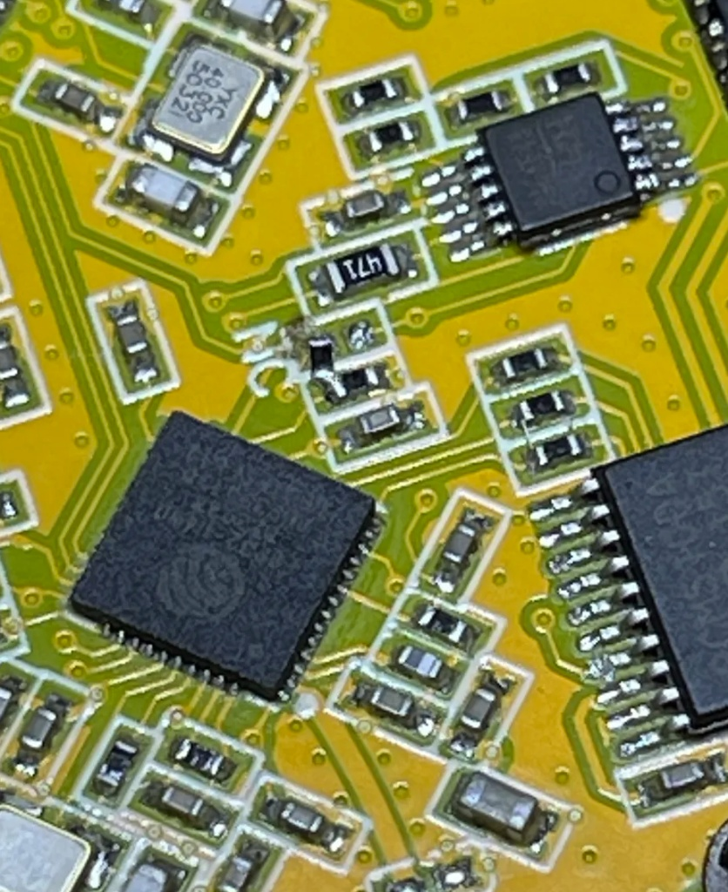
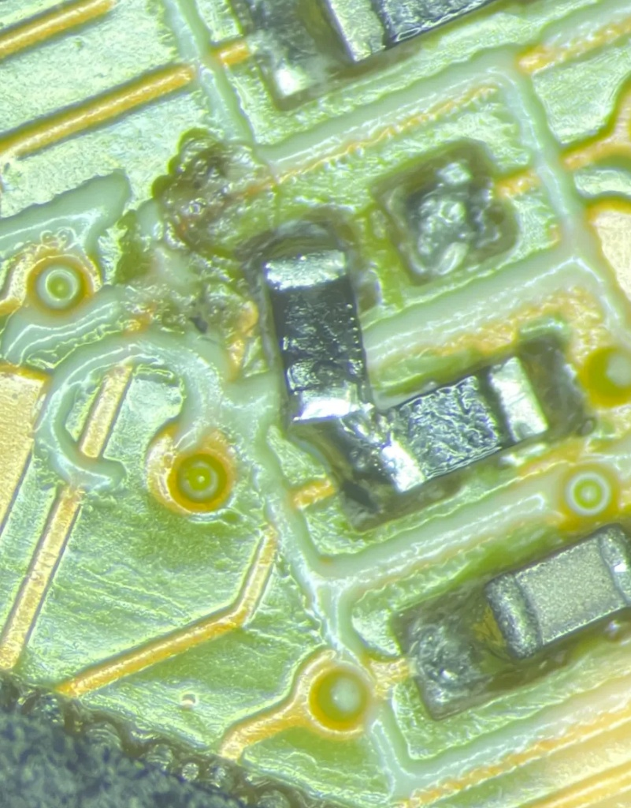

# Guition Knob V1: ESP32-S3 Audio Line-Out Bridge

This repository provides hardware modification details and firmware to enable audio routing from the **ESP32-S3** to the onboard **Line-Out jack** via the secondary ESP32 on the Guition V1 Knob.

## Hardware Architecture & Problem
The Guition Knob V1 utilizes a dual-MCU architecture:
* **Main MCU (ESP32-S3):** Interfaces with the display and haptic motor. This chip includes **PSRAM**, which is required for applications like Sendspin.
* **Secondary MCU (ESP32):** Hardwired to the **PCM5100A DAC**. It lacks PSRAM.
* **The Issue:** The ESP32-S3 has no direct physical connection to the DAC. In the factory configuration, the S3 handles the UI while the ESP32 handles BT/WiFi audio independently. Because the secondary chip lacks PSRAM, it cannot run the Sendspin application, and the S3 cannot natively output audio to the line-out jack.

## Solution: I2S Repeater Bridge
This modification establishes a digital audio path between the two processors, allowing the ESP32-S3 to act as the I2S Master and the secondary ESP32 to act as a transparent I2S repeater.

1.  **Clock Synchronization:** The existing UART traces connecting the two MCUs are repurposed for I2S **BCK** and **LRCK**.
2.  **Data Link (Hardware Mod):** A physical bridge is required to connect **GPIO41 (S3)** to **GPIO2 (ESP32)**. This provides the I2S Data (SD) line.
3.  **Firmware Logic:** The secondary ESP32 runs firmware that initializes an I2S input port (from the S3) and pipes the data to an I2S output port (to the DAC).

## Hardware Modification

The modification requires a 0R link or solder bridge on the unpopulated resistor pads near the secondary ESP32. This connects the S3 GPIO41 signal to the ESP32 GPIO2.

| Macro View | Micro Detail (The Bridge) |
| :---: | :---: |
|  |  |

### Pin Mapping
| Signal | ESP32-S3 (Source) | ESP32 (Repeater) |
| :--- | :--- | :--- |
| **I2S BCK** | Repurposed UART | Repurposed UART |
| **I2S LRCK** | Repurposed UART | Repurposed UART |
| **I2S DATA** | **GPIO41** | **GPIO2** (via Mod) |

## Schematic References
The following schematics outline the signal paths and interconnects used in this modification:
* [Connector Pinouts](./1_CONN.png)
* [Main S3 MCU & Display](./2_ESP32-S3(R8).png)
* [DAC & Audio Output Path](./3_LCD.png)
* [Secondary ESP32 & UART Interconnect](./4_ESP32_U4WDH.png)
* [Power & USB Schematics](./JC3636K518_Power.png)

## Build Instructions

This project uses ESPHome to build and flash the firmware.

### ESP32-S3 (Main Application)
Run the following command from the **root project folder**:
```bash
esphome run sendspin.yaml```
```
ESP32 (Secondary Bridge)
Run the following command from the companion-chip folder:

```Bash
esphome run sendspin-esp32.yaml```
